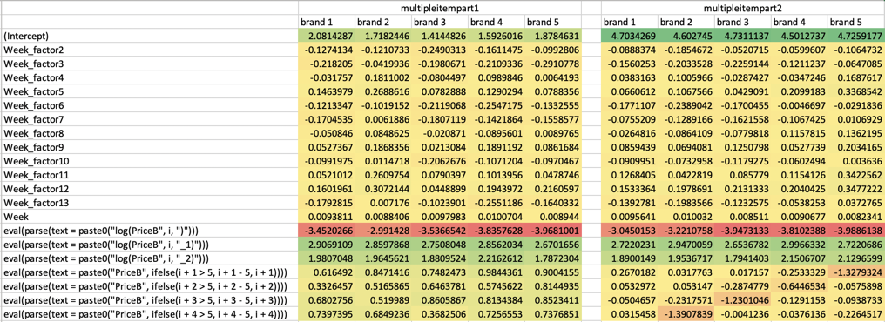
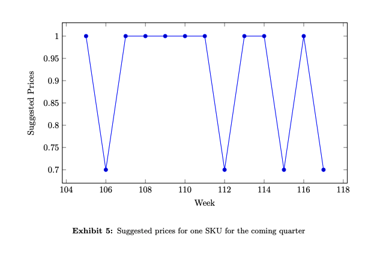

#### 1. What factors do you think one should incorporate in the demand function? Please, discuss.

Considering porter's 5 forces model, I believe factors for the demand function include:

+ price of product - the higher the price the less the willingness to buy the less the demand, 
+ consumer's preferences - loyalty to goods increases spending and demand, 
+ consumer's income - an increase in disposable income enabling consumers to be able to afford more goods, 
+ competitors: competing or cannibalizing products are important as promotions of one brand can affect another brand greatly 
+ availability of substitutes - an increase in the price of a product will increase the demand for its major substitutes, 
+ complements - a fall in price of complements will increase demand, 
+ market size / consumer base - economy of scale can bring down costs and increase demand, 
+ seasonality - weather could drive seasonal demand, and trends - economic cycle, pandemic impacts which could shift consumers behavior / need to a large extent, or more 

### Estimation - Single Item Model

```{r}
# code from 'Studentspart1.R'
## Import data from CSV file, inside "" is the location of your CSV file in your computer. 
Data <- read.csv("singleitemSKU88.csv")

##Add seasonal factor to the data 
Data$Week_factor <-  as.factor(rep(rep(seq(1,13),each=4),3))

library(tidyverse)
Data %>% head()
```

#### 2. Estimate the demand function for SKU88 using R
Train test split
```{r}
# set first 2 years of data as training set
train <- Data %>% filter(Week<=104)

# set the last year of data as testing set
test <- Data %>% filter(Week>104)

# check the number of rows in each set
nrow(train)
nrow(test)
```

(i)the summary of the regressions
```{r}
# run model (1)
lm1 <- lm(log(St) ~ Week_factor + Week+ log(Price), data = train)
# generate the summary of model (1)
summary(lm1)
```

```{r}
# model (2)
lm2 <- lm(log(St) ~ Week_factor + Week+ log(Price) + log(Price_1) + log(Price_2), data = train)
# generate the summary of model (2)
summary(lm2)
```

(ii)the value of R-squared and MAPE

```{r}
 # make predictions on test data
lm1_predict=predict(lm1,test)
lm2_predict=predict(lm2,test)

RSQUARE = function(y_actual,y_predict){
  cor(y_actual,y_predict)^2
}
# R-squared on the test set
RSQUARE(test$St,exp(lm1_predict)) #0.3247033
RSQUARE(test$St,exp(lm2_predict)) #0.9355876
```

```{r}
# compute MAPE
library(MLmetrics)
MAPE(exp(lm1_predict), test$St) #0.8887861
MAPE(exp(lm2_predict), test$St) #0.1133623
```


#### 3. For the model in equation (2), what can you say on the magnitudes of the estimated parameters

From lm2, we can obtain b0=-2.92, b1=2.92, b2=1.89. This shows the price is negatively correlated to the demand, while the effective of last price and second last price on current demand have a positive effect. The higher the current price the lower the demand, but the more the price reduced the higher the demand. Also, recency matters as the effect of the last price is stronger than the second last price.

#### 4. Compute the values of the predicted demand d7 using models (1) and (2) above.

Assume p7=1, p6=0.8 and p5=0.8, we can predict the demand of week 7 (d7) as follows
```{r}
# set assumption parameters
p7=1
p6=0.8
p5=0.8

# prediction using model (1)
a0=coef(lm1)[1]
a2=coef(lm1)[2]
trend=coef(lm1)[14]
b0=coef(lm1)[15]

a0=coef(lm1)[1]
a2=coef(lm1)[2]
trend=coef(lm1)[14]
b0=coef(lm1)[15]

exp(a0+a2+trend*7+b0*log(p7)) #233.7596 
```

```{r}
# prediction using model (2)
a0=coef(lm2)[1]
a2=coef(lm2)[2]
trend=coef(lm2)[14] 
b0=coef(lm2)[15]
b1=coef(lm2)[16]
b2=coef(lm2)[17]

exp(a0+a2+trend*7+b0*log(p7)+b1*log(p6)+b2*log(p5)) #83.96775 
```


#### 5. Discuss the differences between the two models (1) and (2) above. For which type of products do you think that model (2) is better? Please discuss.

The demand predicted using model 1 (253.14) is higher than model 2 (84.30). Model 2 has considered the effect of last two prices on current demand and predicts a lower demand that consumers are less willing to buy after price increase, hence might be more applicable for non-essential products with volatile pricing.  


### Estimation - Multiple Items

```{r}
# code from 'Studentspart2.R'
## Read data from CSV file
DATA <- read.csv("multipleitempart1.csv")

## Adding week factor indicator 
DATA$Week_factor <- as.factor(rep(rep(seq(1,13),each=4),3))
```

#### 6. Estimate the demand function for the 5 different brands using R
Train test split
```{r}
# set first 2 years of data as training set
train <- DATA %>% filter(Week<=104)

# set the last year of data as testing set
test <- DATA %>% filter(Week>104)

# check the number of rows in each set
nrow(train)
nrow(test)
```

(i)the summary of the regressions

```{r}
# run models
for(i in 1:5){
  # run model (1)
  assign(paste0("lm",i),lm(log(get(paste0("S",i,"_t"))) ~ Week_factor + Week 
                           + eval(parse(text=paste0("log(PriceB",i,")")))
                           + eval(parse(text=paste0("log(PriceB",i,"_1)")))
                           + eval(parse(text=paste0("log(PriceB",i,"_2)")))
                           + eval(parse(text=paste0("PriceB",ifelse(i+1>5,i+1-5,i+1))))
                           + eval(parse(text=paste0("PriceB",ifelse(i+2>5,i+2-5,i+2))))
                           + eval(parse(text=paste0("PriceB",ifelse(i+3>5,i+3-5,i+3))))
                           + eval(parse(text=paste0("PriceB",ifelse(i+4>5,i+4-5,i+4))))
                           , data = train))
  # generate the summary of each model
  print(paste0("===============brand",i,"================"))
  print(summary(get(paste0("lm",i))))
}

```

(ii)the value of R-squared and MAPE
```{r}
library(MLmetrics)
attach(test)
for(i in 1:5){
  # make predictions on test data
  assign(paste0("lm",i,"_predict"), predict(get(paste0("lm",i)),test))
  # compute R-squared on the test set
  print(RSQUARE(get(paste0("S",i,"_t")),exp(get(paste0("lm",i,"_predict")))))
}
```

```{r}
for(i in 1:5){
  # compute MAPE
  print(MAPE(exp(get(paste0("lm",i,"_predict"))), get(paste0("S",i,"_t"))))
}
```


#### 7. Repeat the same procedure as in Question 6 using the data from the csv file "multipleitem-part2.csv"

```{r}
# code from 'Studentspart2.R'
## Read data from CSV file
DATA <- read.csv("multipleitempart2.csv")

## Adding week factor indicator 
DATA$Week_factor <- as.factor(rep(rep(seq(1,13),each=4),3))
```

Train test split
```{r}
# set first 2 years of data as training set
train <- DATA %>% filter(Week<=104)

# set the last year of data as testing set
test <- DATA %>% filter(Week>104)

# check the number of rows in each set
nrow(train)
nrow(test)
```

(i)the summary of the regressions
```{r}
# run models
for(i in 1:5){
  # run model (1)
  assign(paste0("new_lm",i),lm(log(get(paste0("S",i,"_t"))) ~ Week_factor + Week 
                           + eval(parse(text=paste0("log(PriceB",i,")")))
                           + eval(parse(text=paste0("log(PriceB",i,"_1)")))
                           + eval(parse(text=paste0("log(PriceB",i,"_2)")))
                           + eval(parse(text=paste0("PriceB",ifelse(i+1>5,i+1-5,i+1))))
                           + eval(parse(text=paste0("PriceB",ifelse(i+2>5,i+2-5,i+2))))
                           + eval(parse(text=paste0("PriceB",ifelse(i+3>5,i+3-5,i+3))))
                           + eval(parse(text=paste0("PriceB",ifelse(i+4>5,i+4-5,i+4))))
                           , data = train))
  # generate the summary of each model
  print(paste0("===============brand",i,"================"))
  print(summary(get(paste0("new_lm",i))))
}


```

(ii)the value of R-squared and MAPE
```{r}
library(MLmetrics)
attach(test)
for(i in 1:5){
  # make predictions on test data
  assign(paste0("lm",i,"_predict"), predict(get(paste0("lm",i)),test))
  # compute R-squared on the test set
  print(RSQUARE(get(paste0("S",i,"_t")),exp(get(paste0("lm",i,"_predict")))))
}
```

```{r}
for(i in 1:5){
  # compute MAPE
  print(MAPE(exp(get(paste0("lm",i,"_predict"))), get(paste0("S",i,"_t"))))
}
```

#### 8. Compute the values of the predicted demands
```{r}
# prediction using model (3) when PriceB1_7=1
for(i in 1:5){
  assign(paste0("PriceB",i,"_7"),1) #PriceB1_7, when i=1
}

for (i in 1:5){
  PriceB1_7=1 #overwrite with case PriceB1_7=1
  assign(paste0("PriceB",i,"_6"),1) #PriceB1_6, when i=1
  assign(paste0("PriceB",i,"_5"),1) #PriceB1_5, when i=1
  
  assign(paste0("a",i,"_0"),coef(get(paste0("lm",i)))[1]) #a1_0, when i=1
  a2=coef(get(paste0("lm",i)))[2]
  trend=coef(get(paste0("lm",i)))[14]
  
  assign(paste0("b",i,"_0"),as.numeric(sub("^.+) ", "", coef(get(paste0("lm",i)))[15]))) #b1_0, when i=1
  assign(paste0("b",i,"_1"),as.numeric(sub("^.+) ", "", coef(get(paste0("lm",i)))[16]))) #b1_1, when i=1
  assign(paste0("b",i,"_2"),as.numeric(sub("^.+) ", "", coef(get(paste0("lm",i)))[17]))) #b1_2, when i=1
  
  s1=as.numeric(sub("^.+) ", "", coef(get(paste0("lm",i)))[18])) #s1
  s2=as.numeric(sub("^.+) ", "", coef(get(paste0("lm",i)))[19])) #s2
  s3=as.numeric(sub("^.+) ", "", coef(get(paste0("lm",i)))[20])) #s3
  s4=as.numeric(sub("^.+) ", "", coef(get(paste0("lm",i)))[21])) #s4
  
  #assign(paste0("S",i,"_t * PriceB",ifelse(i+1>5,i+1-5,i+1)),as.numeric(sub("^.+) ", "", coef(get(paste0("lm",i)))[18]))) #s2_1, when i=1
  #assign(paste0("S",i,"_t * PriceB",ifelse(i+2>5,i+2-5,i+2)),as.numeric(sub("^.+) ", "", coef(get(paste0("lm",i)))[19]))) #s3_1, when i=1
  #assign(paste0("S",i,"_t * PriceB",ifelse(i+3>5,i+3-5,i+3)),as.numeric(sub("^.+) ", "", coef(get(paste0("lm",i)))[20]))) #s4_1, when i=1
  #assign(paste0("S",i,"_t * PriceB",ifelse(i+4>5,i+4-5,i+4)),as.numeric(sub("^.+) ", "", coef(get(paste0("lm",i)))[21]))) #s5_1, when i=1
  
  print(exp(get(paste0("a",i,"_0")) #a1_0, when i=1
            +a2
            +trend*7
            +get(paste0("b",i,"_0"))*log(get(paste0("PriceB",i,"_7"))) #b1_0*log(PriceB1_7), when i=1
            +get(paste0("b",i,"_1"))*log(get(paste0("PriceB",i,"_6"))) #b1_1*log(PriceB1_6), when i=1
            +get(paste0("b",i,"_2"))*log(get(paste0("PriceB",i,"_5"))) #b1_2*log(PriceB1_5), when i=1
            +s1*get(paste0("PriceB",ifelse(i+1>5,i+1-5,i+1),"_7")) #s1*PriceB2_7, when i=1
            +s2*get(paste0("PriceB",ifelse(i+2>5,i+2-5,i+2),"_7")) #s2*PriceB3_7, when i=1
            +s3*get(paste0("PriceB",ifelse(i+3>5,i+3-5,i+3),"_7")) #s3*PriceB4_7, when i=1
            +s4*get(paste0("PriceB",ifelse(i+4>5,i+4-5,i+4),"_7")))) #s4*PriceB5_7, when i=1
}
```


```{r}
# prediction using model (3) when PriceB1_7=0.7
for(i in 1:5){
  assign(paste0("PriceB",i,"_7"),1) #PriceB1_7, when i=1
}

for (i in 1:5){
  PriceB1_7=0.7 #overwrite with case PriceB1_7=0.7
  assign(paste0("PriceB",i,"_6"),1) #PriceB1_6, when i=1
  assign(paste0("PriceB",i,"_5"),1) #PriceB1_5, when i=1
  
  assign(paste0("a",i,"_0"),coef(get(paste0("lm",i)))[1]) #a1_0, when i=1
  a2=coef(get(paste0("lm",i)))[2]
  trend=coef(get(paste0("lm",i)))[14]
  
  assign(paste0("b",i,"_0"),as.numeric(sub("^.+) ", "", coef(get(paste0("lm",i)))[15]))) #b1_0, when i=1
  assign(paste0("b",i,"_1"),as.numeric(sub("^.+) ", "", coef(get(paste0("lm",i)))[16]))) #b1_1, when i=1
  assign(paste0("b",i,"_2"),as.numeric(sub("^.+) ", "", coef(get(paste0("lm",i)))[17]))) #b1_2, when i=1
  
  s1=as.numeric(sub("^.+) ", "", coef(get(paste0("lm",i)))[18])) #s1
  s2=as.numeric(sub("^.+) ", "", coef(get(paste0("lm",i)))[19])) #s2
  s3=as.numeric(sub("^.+) ", "", coef(get(paste0("lm",i)))[20])) #s3
  s4=as.numeric(sub("^.+) ", "", coef(get(paste0("lm",i)))[21])) #s4
  
  print(exp(get(paste0("a",i,"_0")) #a1_0, when i=1
            +a2
            +trend*7
            +get(paste0("b",i,"_0"))*log(get(paste0("PriceB",i,"_7"))) #b1_0*log(PriceB1_7), when i=1
            +get(paste0("b",i,"_1"))*log(get(paste0("PriceB",i,"_6"))) #b1_1*log(PriceB1_6), when i=1
            +get(paste0("b",i,"_2"))*log(get(paste0("PriceB",i,"_5"))) #b1_2*log(PriceB1_5), when i=1
            +s1*get(paste0("PriceB",ifelse(i+1>5,i+1-5,i+1),"_7")) #s1*PriceB2_7, when i=1
            +s2*get(paste0("PriceB",ifelse(i+2>5,i+2-5,i+2),"_7")) #s2*PriceB3_7, when i=1
            +s3*get(paste0("PriceB",ifelse(i+3>5,i+3-5,i+3),"_7")) #s3*PriceB4_7, when i=1
            +s4*get(paste0("PriceB",ifelse(i+4>5,i+4-5,i+4),"_7")))) #s4*PriceB5_7, when i=1
}
```

From the above estimation, we can see that the demand of setting the price of brand 1 lower will increase the demand significantly from 80.5 to 276.0, while the effect to other brands' demand are negative and of relatively lower magnitude - demand of brands 2-5 will drop for a range of 10.8 to 40.8. Overall, the net demand change for all brands is positive for a net +115.4, i.e. promoting brand 1 gives a boost of demand from consumers overall. 

#### 9. Compare the estimated parameters from Questions 6 and 7. What is the difference between the 5 brands from Question 6 and the 5 brands from Question 7? Please, discuss.


Exhibit - Table comparison of estimates of the 5 brands from Q6 and Q7

In general, the 5 brands in part 1 have higher average demands and lower variance / standard deviation than part 2. Potentially part 1 brands having more diverse intercepts target more niche market respectively or clear differentiation of same product across brands that the price of brand affecting another brand is less significant than part 2. It is observed that the parameters sigma are of higher magnitude in part 2 and part 2 brands are more like substitute in which price of a brand would affect the demand of another brand easily. From p-values, we can also observe significance for most part 1 parameters sigma but only for those high magnitude ones in part 2. This further supports more difference between 5 brands in part 1 in comparison to part 2.

### Optimization Formulation

#### 10. What types of objectives would you consider? Please discuss.
In the formulation of optimization problem, we can set the objective function as
* maximizing the sum of product of price multiplied by the demand of 5 similar items from different brands
* maximizing the sum of demand or log of demand of all 5 brands
* maximizing the sum of demand of one targeted brand while adhering to rule-based decisions for other brands such as certain thresholds
* any other promotion strategy like promoting based on prevailing offers or strategic partnership with certain brand, that can potentially maximize revenue beyond product level to departmental or company level


#### 11. How can one represent such a restriction using linear constraints and binary variables?

The formulation of the optimization problem is confined to the following constraints. 

1. normalized laddered price of SKU which can take only four values - x1 at full price, x0.9 at 10% promotion, x0.8 at 20% promotion and x0.7 at 30% promotion

$$p_{t}=(a^{k=1}_{t})+0.9(a^{k=2}_{t})+0.8(a^{k=3}_{t})+0.7(a^{k=4}_{t})$$
2. each price can be used once only

$$\sum\limits_{k=1}^{4}a^{k}_{t} \text{=1 }\forall{t}$$

3. binary decision variables for price ladder - 1 denotes a promotion strategy is selected

$$a^{k}_{t}=\text{{0,1} }\forall{t},{k}$$

#### 12. How can you model this business rule as a linear constraint with binary variables?

The formulation of the optimization problem is confined to constraint on at most 4 promotions. 
$$ \sum\limits_{t=1}^{T}\sum\limits_{k=1}^{4}a^{k}_{t}<=4$$
where T is the number of periods

#### 13. Please, formulate the optimization problem with the constraint on the limitation of the number of promotions to be at most 4

In the formulation of optimization problem, we are going to set the objective function as maximizing the sum of product of profits (which is the price minus cost) multiplied by the demand of 5 similar items from different brands

$$ \text{maximize }\sum\limits_{t=1}^{13}\displaystyle\sum\limits_{i=1}^{5}(p^{i}_{t}-c^{i}_{t})d^{i}_{t}$$
where $$p^{i}_{t}$$, $$c^{i}_{t}$$ and $$d^{i}_{t}$$ is the price, cost and demand for brand $$i$$ during week $$t$$ respectively in reference to model(3). 

The formulation of the optimization problem is confined to the following constraints. 

1. normalized price of SKU which can take only four values - x1 at full price, x0.9 at 10% promotion, x0.8 at 20% promotion and x0.7 at 30% promotion
$$p_{t}=(a^{k=1}_{t})+0.9(a^{k=2}_{t})+0.8(a^{k=3}_{t})+0.7(a^{k=4}_{t})$$

2. each price can be used once only
$$\sum\limits_{k=1}^{4}a^{k}_{t} \text{=1 }\forall{t}$$

3. binary decision variables - 1 denotes a promotion strategy is selected
$$a^{k}_{t}=\text{{0,1} }\forall{t},{k}$$

#### 14. What tests would you conduct in order to check that the suggested prices are robust? Please discuss.

The optimization problem solution has solved 4 promotions each by 30% during 13 weeks as follows. The duration of promotion is the same across for 2 weeks. The frequency of promotion is once in 2 months at the beginning and increased to once a month and once every 2 weeks, i.e. more often towards the end of quarter to boost demand and sales. 

We can conduct hypothesis testing to check that the suggested price is robust, by assuming the null hypothesis that the price is robust and alternative hypothesis the otherwise. From statistics, we can compute and mean and standard deviation of the price and p-value of mean. If p is greater than the critical threshold, we can reject the null in favor of the alternative, i.e. the price is not robust. 

Another testing approach could be A/B testing that runs different products within the same category type or different customers within the same product to collect demand data on various pricing. From sales conversion we can hence figure out the optimal price points and conclude whether the suggested prices are robust. 

Based on the concept of exploration and exploitation, we can consider to adjust the observation and prediction windows for training the optimization model to continuously fine-tune the optional prices, run empirical testing and update the above test strategy accordingly. More frequent revisit of suggested price is recommended. 

 


#### 15. Should the promotions of the different items be at the same time, or at different times? Please discuss the various factors that may affect the answer to this question.

The are both pros and cons in promoting different items simultaneously and at different times. If promoting different items simultaneously, a grocery store can enjoy synergies of promotional effect to produce greater noises to attract consumers and enhance the exposure compared to other grocery competitors. This kind of big sale can be a good differentiator and secure greater demand in the market. Big spending would be encouraged during sales periods. 

On the contrary, promoting different items at different times allows more optimized sales and revenue by pricing right to the demand. The lost revenue captured can fund other marketing activities to compensate for the buzz effect promoting simultaneously. To consumers, this can provide some affordable option for most of the time and encourage smaller but more frequent spending. 

The better strategy could be formulated based on the following considerations. 

+ overall grocery's branding and pricing strategies - subject to the market positioning, a grocery store could be more economical / more premium, with high pricing big promotion / low pricing with fewer promotions, etc. The grocery store shall consider the marketing objective of such promotions to overall grocery image and the business priority on other benefits (e.g. customer loyalty) against revenue. 

+ demand of brands - we want to understand if the demand of items are correlated that one brand's promotion would effect the demand of another brand item. More specifically, if products are substitute to each other, their demand are negatively correlated and promoting simultaneously is not optimal. If products are complementary, it can be bundled offer that boosts demand and generates increased sales. 

+ partnership with brands - sometimes promotions are constrained to contracts with suppliers. Strategic partners might require exclusive treatment or price protection to secure their brand images. Such constraints shall be considered in the optimization problem for both simultaneous and different times promotion and may pose different extent of effect. 

+ consumers behaviors and trends - consumers behaviors e.g. purchase volume, frequency, and recency, as well as whether they are willing to pill stocks on the items would impact our promotion decision. Trends like growing or shrinking market, seasonal effect (black Friday sale is expected by most consumers, end of season sale to clear inventory) and pandemic situation shall be incorporated into the optimization problem. Analysis on historical purchasing behaviors could reveal more insights on demand (especially the simultaneous effect), hypothesis to test out and higher accuracy in demand forecast before concluding the best promotion strategy. 


